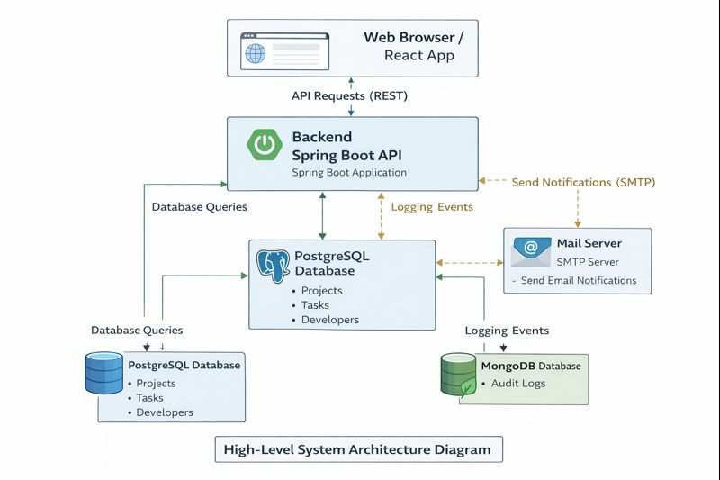
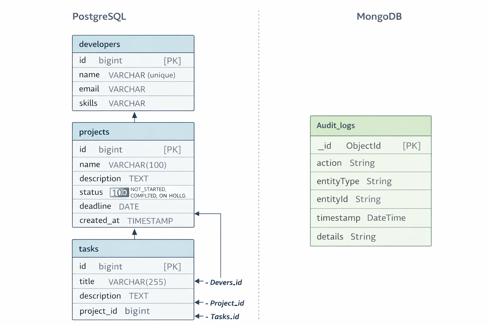

"# Project_Tracker" 
# Project_Tracker API

## Project Overview
--In this Project,I will develop a multi-entity Project Tracker API  
that uses Spring Data JPA to persist data to a relational database and explore caching, transaction management, and advanced querying.
Later,I will integrate a NoSQL module to store audit logs using MongoDB. 
I will implement pagination, sorting, and performance best practices to optimize query execution.


## Features

* CRUD operations for **Projects**, **Tasks**, and **Developers**
* **Audit logging** (stored in MongoDB)
* Pagination & sorting support
* Swagger / OpenAPI documentation
* Email notifications for overdue tasks (Spring Events)
* Docker & Docker Compose support

---

## Architecture


## Database Schema



## Tech Stack

* **Java:** 21
* **Spring Boot:** 3.x
* **Databases:**

    * PostgreSQL (JPA entities)
    * MongoDB (Audit Logs)
* **Build Tool:** Maven
* **Containers:** Docker, Docker Compose
* **API Docs:** Springdoc OpenAPI (Swagger UI)

---

## Project Structure

```
com.BuildMaster.Project_Tracker
project-tracker/
│
├── src/
│   └── main/
│       ├── java/
│       │   └── com/
│       │       └── BuildMaster/
│       │           └── Project_Tracker/
│       │               ├── ProjectTrackerApplication.java
│       │               │
│       │               ├── controller/
│       │               │   ├── ProjectController.java
│       │               │   ├── TaskController.java
│       │               │   ├── DeveloperController.java
│       │               │   └── AuditLogController.java
│       │               │
│       │               ├── entity/
│       │               │   ├── Project.java
│       │               │   ├── Task.java
│       │               │   ├── Developer.java
│       │               │   └── AuditLog.java
│       │               │
│       │               ├── repository/
│       │               │   ├── jpa/
│       │               │   │   ├── ProjectRepository.java
│       │               │   │   ├── TaskRepository.java
│       │               │   │   └── DeveloperRepository.java
│       │               │   │
│       │               │   └── mongo/
│       │               │       └── AuditLogRepository.java
│       │               │
│       │               ├── service/
│       │               │   ├── ProjectService.java
│       │               │   ├── TaskService.java
│       │               │   ├── DeveloperService.java
│       │               │   └── implementations/
│       │               │       ├── ProjectServiceImp.java
│       │               │       ├── TaskServiceImp.java
│       │               │       └── DeveloperServiceImp.java
│       │               │
│       │               ├── events/
│       │               │   ├── TaskOverdueEvent.java
│       │               │   └── TaskEventListener.java
│       │               │
│       │               └── config/
│       │                   └── RepositoryConfig.java
│       │
│       └── resources/
│           ├── application.yml
│           └── application-docker.yml
│
├── diagrams/
│   ├── project-tracker-erd.png
│   └── system-architecture.png
│
├── Dockerfile
├── docker-compose.yml
├── pom.xml
└── README.md


---

## Prerequisites

Make sure you have the following installed:

* Java 21
* Maven 3.9+
* Docker & Docker Compose
* PostgreSQL (optional if using Docker)
* MongoDB (optional if using Docker)

---

## Running Locally (Without Docker)

###  Configure `application.properties`

```
spring.application.name=Project_Tracker

spring.datasource.url=jdbc:postgresql://localhost:5432/project
spring.datasource.username=postgres
spring.datasource.password=newpassword

spring.datasource.driver-class-name=org.postgresql.Driver


spring.jpa.database-platform=org.hibernate.dialect.PostgreSQLDialect
spring.jpa.hibernate.ddl-auto=update
spring.jpa.show-sql=true
spring.jpa.properties.hibernate.format_sql=true


spring.data.mongodb.host=localhost
spring.data.mongodb.port=27017
spring.data.mongodb.database=tracker_audit_logs
```

###  Build the project

```bash
mvn clean install
```

### 3️⃣ Run the application

```bash
mvn spring-boot:run
```

Application will start at:

```
http://localhost:8080
```

---

##  Running with Docker Compose (Recommended)

###  Docker Compose file

```yaml
services:
  api:
    build: .
    container_name: project_tracker-api
    ports:
      - "8080:8080"
    environment:
      SPRING_DATASOURCE_URL: jdbc:postgresql://db:5432/projectDb
      SPRING_DATASOURCE_USERNAME: postgres
      SPRING_DATASOURCE_PASSWORD: postgres
      SPRING_JPA_HIBERNATE_DDL_AUTO: update
      SPRING_DATA_MONGODB_URI: mongodb://mongo:27017/auditdb
    depends_on:
      - db
      - mongo

  db:
    image: postgres:16
    container_name: project-tracker-db
    environment:
      POSTGRES_DB: projectDb
      POSTGRES_USER: postgres
      POSTGRES_PASSWORD: postgres
    ports:
      - "5432:5432"

  mongo:
    image: mongo:7
    container_name: project-tracker-mongo
    ports:
      - "27017:27017"
```


## Dockerized View ##
Docker Compose
├── project_tracker-api (Spring Boot)
├── postgres-db
└── mongo-db


###  Build & start containers

```bash
docker compose up --build
```

---

## API Documentation (Swagger)

Once the app is running, access Swagger UI at:
http://localhost:8080/swagger-ui.html

---

## Email Notifications (Overdue Tasks)

* Uses **Spring Events**
* Triggered when a task becomes overdue
* Uses **Gmail SMTP**

### Gmail App Password (Important)

If you use **2FA on Gmail**, you must generate an **App Password** and use it instead of your normal email password.

---

## 🧾 Audit Logs

* Stored in **MongoDB**
* Logs actions like CREATE, UPDATE, DELETE
* Can be queried by:

    * entity type
    * actor name

---

## Build Docker Image Manually

```bash
docker build -t project_tracker-api .
```

---

## Future features to be added;
1. Security
2. UI


## 👤 Author

**Ernest Danso Opoku**
Project Tracker API


